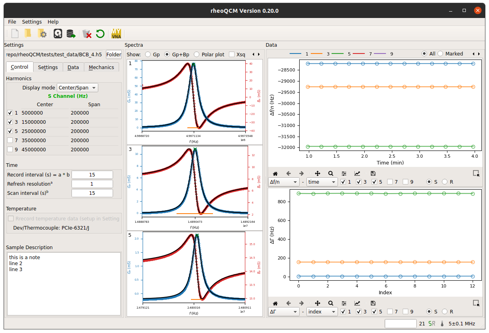

:orphan:

# Overview

RheoQCM is a Python suite for QCM-D analysis, with a modern JAX-powered
rheological modeling core and a PyQt6 GUI for visualization and data
exploration. The project supports Linux, macOS, and Windows.

Key capabilities:

- High-performance modeling with JAX (GPU-accelerated when available)
- Import and analyze external QCM-D datasets
- Multilayer thin-film analysis with the Small Load Approximation (SLA)
- Bayesian parameter estimation with MCMC (NumPyro backend)

For background theory and references, see the materials in the References
section.
